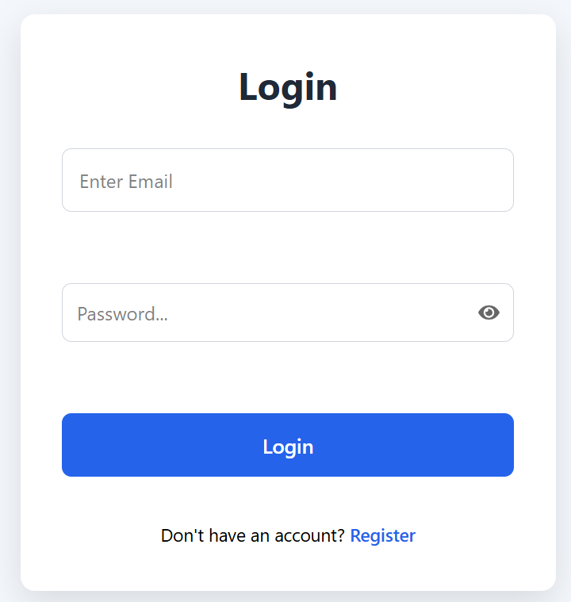
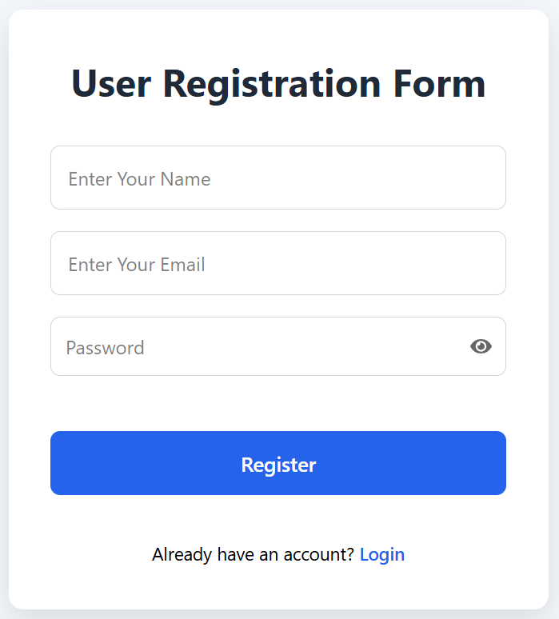
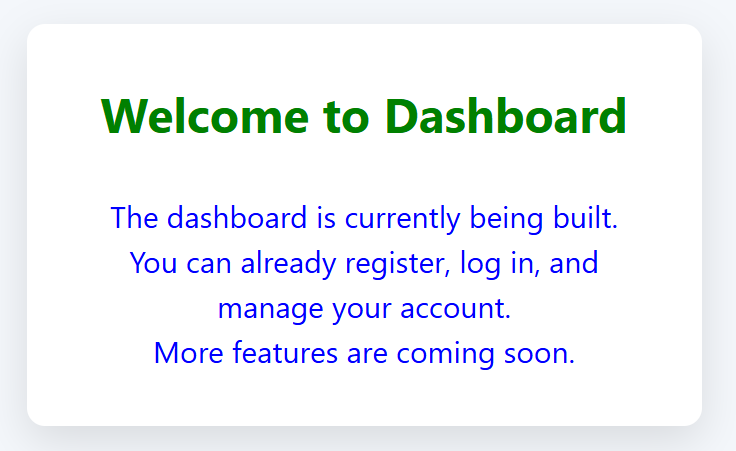

# 📊 Data Analysis App

A modern full-stack **Data Analysis Web Application** built with **React**, **Flask**, and **MySQL**. The application provides a secure authentication system and allows users to manage datasets through a clean, responsive, and user-friendly interface.

---

# 🚀 Live Demo

🌐 Frontend:
https://data-analysis-app-seven.vercel.app/

🔗 Backend API:
https://your-backend-url.com/

---

## 🚀 Features

### Authentication

* ✅ User Registration
* ✅ Secure User Login
* ✅ Password Hashing
* ✅ Session-Based Authentication

### Dataset Management

* ✅ Create Dataset
* ✅ View Dataset
* ✅ Update Dataset
* ✅ Delete Dataset (CRUD Operations)

### Frontend

* ⚛️ React + Vite
* 📱 Responsive Design
* 🎨 Modern User Interface
* ⚡ Fast Performance

### Backend

* 🐍 Flask REST API
* 🔐 Secure Authentication
* 🌐 CORS Enabled
* 📦 SQLAlchemy ORM

### Database

* 🗄️ MySQL Database
* 📊 Efficient Data Storage

---

# 🛠️ Tech Stack

## Frontend

* React
* Vite
* JavaScript (ES6+)
* CSS

## Backend

* Flask
* Flask SQLAlchemy
* Flask CORS
* PyMySQL

## Database

* MySQL

## Development Tools

* Git
* GitHub
* VS Code

---

# 📁 Project Structure

```text
data-analysis-app/
│
├── backend/
│   ├── app.py
│   ├── config.py
│   ├── models/
│   ├── routes/
│   ├── database/
│   ├── requirements.txt
│   └── .env
│
├── frontend/
│   ├── src/
│   ├── public/
│   ├── package.json
│   └── vite.config.js
│
└── README.md
```

---

# ⚙️ Installation

## 1. Clone the Repository

```bash
git clone https://github.com/AlamgirKhan48692/data-analysis-app.git
```

```bash
cd data-analysis-app
```

---

## 2. Backend Setup

```bash
cd backend
```

Install dependencies:

```bash
pip install -r requirements.txt
```

Create a `.env` file:

```env
DATABASE_URL=your_database_url
SECRET_KEY=your_secret_key
```

Run the Flask server:

```bash
python app.py
```

---

## 3. Frontend Setup

Open a new terminal:

```bash
cd frontend
```

Install dependencies:

```bash
npm install
```

Start the development server:

```bash
npm run dev
```

---

# 🌐 API Endpoints

| Method | Endpoint         | Description         |
| ------ | ---------------- | ------------------- |
| POST   | `/register`      | Register a new user |
| POST   | `/login`         | User login          |
| GET    | `/datasets`      | Get all datasets    |
| POST   | `/datasets`      | Create a dataset    |
| PUT    | `/datasets/<id>` | Update a dataset    |
| DELETE | `/datasets/<id>` | Delete a dataset    |

---

# 📸 Screenshots


### Login Page



---

### Registration Page



---

### Dashboard



---

# 🔮 Future Improvements

* 🔐 JWT Authentication
* 🛡 Protected Routes
* 🚪 Logout
* 👤 User Profile
* 📧 Email Verification
* 🔄 Password Reset
* 🔍 Search Functionality
* 📄 Pagination
* 📊 Dashboard Analytics
* 🌙 Dark Mode

---

# 🤝 Contributing

Contributions are welcome!

1. Fork the repository.
2. Create a new feature branch.
3. Commit your changes.
4. Push the branch.
5. Open a Pull Request.

---

# 📄 License

This project is licensed under the MIT License.

---

# 👨‍💻 Author

**Alamgir Khan**

GitHub:
https://github.com/AlamgirKhan48692
